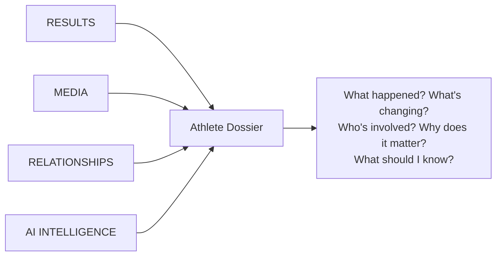
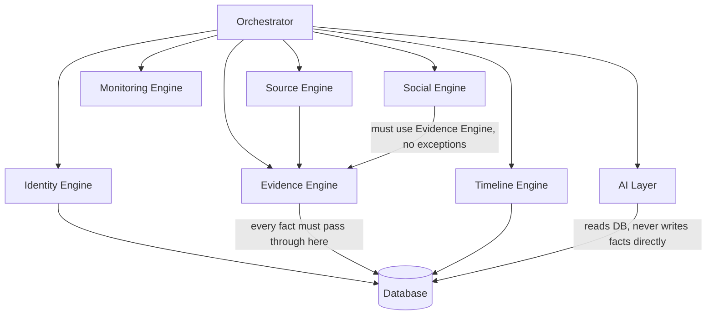
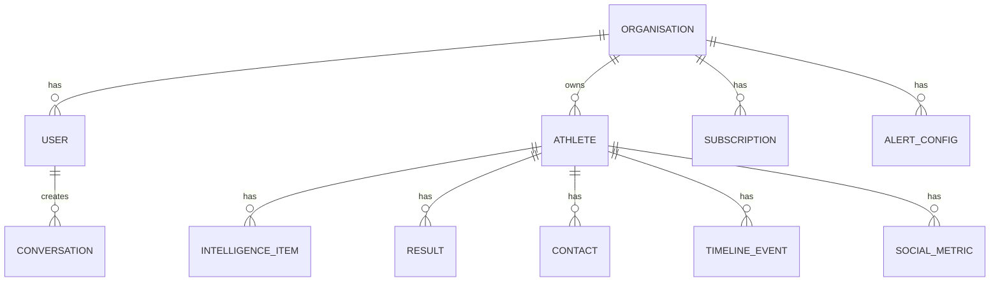
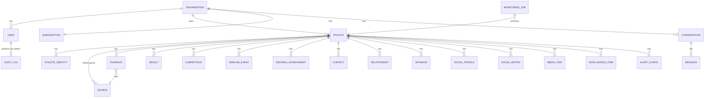

# Athlete Intelligence — Master Product & Architecture Specification for Lovable

**Purpose of this document:** This is the definitive blueprint for rebuilding **Athlete Intelligence** on Lovable. It is written for an AI product-building platform that has never seen this project before. It is based on a thorough inspection of the existing repository (`github.com/anigemmill/athlete-intelligence`, Replit-hosted, pnpm monorepo) — its documentation, its schema, its API routes, and its own internal audits — combined with the new visual direction supplied for this rebuild.

**How to read the labels used throughout this document:**

- **CURRENT / EXISTS** — actually implemented in the Replit codebase today, verified by reading the code or schema directly.
- **CURRENT / INCOMPLETE** — partially built; something is wired but doesn't fully work (e.g., a UI exists but the backend is a no-op).
- **CURRENT / BROKEN** — implemented but demonstrably wrong or non-functional.
- **TARGET / PROPOSED** — does not exist today; this is what the new Lovable build should become.
- **Not established in the current repository** — used whenever the source prompt for this spec asserted something as fact that could not be confirmed by inspection. These are called out explicitly rather than silently resolved.

This document does not simply describe the current codebase. It uses the current build — including its own internal audits, which are unusually candid and already did much of this diagnostic work — as the evidence base for a better target architecture. **No application code was changed to produce this document.**

---

## Table of Contents

1. [Product Purpose](#1-product-purpose)
2. [What "Currently Exists" Actually Means Here](#2-what-currently-exists-actually-means-here)
3. [Core Product Concept — Four Pillars](#3-core-product-concept--four-pillars)
4. [The Athlete Dossier](#4-the-athlete-dossier)
5. [Evidence-First Intelligence](#5-evidence-first-intelligence)
6. [Lessons from the Brook Macdonald / Social Metrics Issue](#6-lessons-from-the-brook-macdonald--social-metrics-issue)
7. [AI Agent Architecture — Current and Target](#7-ai-agent-architecture--current-and-target)
8. [Multi-Tenancy](#8-multi-tenancy)
9. [User Management](#9-user-management)
10. [Admin Console](#10-admin-console)
11. [Billing](#11-billing)
12. [Dashboard](#12-dashboard)
13. [Intelligence Feed](#13-intelligence-feed)
14. [Alerts](#14-alerts)
15. [AI Analyst / Chat](#15-ai-analyst--chat)
16. [Search](#16-search)
17. [Relationship Graph](#17-relationship-graph)
18. [Global Map](#18-global-map)
19. [Timeline](#19-timeline)
20. [Target Data Model](#20-target-data-model)
21. [Authentication](#21-authentication)
22. [Replit-Specific Dependencies and Their Replacements](#22-replit-specific-dependencies-and-their-replacements)
23. [Visual Design System](#23-visual-design-system)
24. [Marketing Site](#24-marketing-site)
25. [Product UX Flow](#25-product-ux-flow)
26. [Onboarding](#26-onboarding)
27. [Imports](#27-imports)
28. [Monitoring Architecture](#28-monitoring-architecture)
29. [Data Quality Framework](#29-data-quality-framework)
30. [Security](#30-security)
31. [Scalability](#31-scalability)
32. [Lessons from the Replit Build](#32-lessons-from-the-replit-build)
33. [MVP vs. Version 1 vs. Future](#33-mvp-vs-version-1-vs-future)
34. [Lovable Build Strategy](#34-lovable-build-strategy)
35. [Documentation vs. Code Discrepancies Found](#35-documentation-vs-code-discrepancies-found)
36. [Things Not Established in the Current Repository](#36-things-not-established-in-the-current-repository)
37. [Lovable Build Brief](#37-lovable-build-brief)

---

## 1. Product Purpose

**Athlete Intelligence is a B2B SaaS intelligence platform for elite sport.**

> "Every athlete has data. We create intelligence."
> "The intelligence platform for elite sport."

Every athlete generates enormous amounts of public information — results, rankings, media coverage, social activity, sponsorship deals, coaching and management changes. Today, organisations either pay staff to manually track this by hand, or they don't track it systematically at all. Athlete Intelligence continuously collects, structures, validates, and interprets that public information so organisations understand their athletes and the wider competitive landscape without manual research.

**Target customers:**
- National sporting organisations (federations)
- Professional sports clubs
- Talent agencies
- Athlete management organisations
- Other high-performance sport organisations

**Core product promise (CURRENT / EXISTS, stated in `CLAUDE.md`):** *"trustworthy, evidence-attributed intelligence on any elite athlete — with a confidence score on every data point."* This is the correct promise and should carry forward unchanged into the target product. The gap the rebuild must close is not the promise — it's making the system actually satisfy it consistently across every data category, and making the product safe to sell to more than one customer at a time (see §8).

---

## 2. What "Currently Exists" Actually Means Here

Before going further, it's important to state plainly what kind of "current system" this is, because it changes how this document should be read.

The existing Replit build is **further along on its core AI research architecture than most MVPs**, and unusually well-documented — the repository contains its own commissioned audits (`AUDIT_REPORT.md`, July 2026; `docs/product-technical-feasibility-audit-2026-08-10.md`, August 2026) that already did a rigorous, code-level accuracy and readiness review. This spec leans heavily on those audits' findings because they are more current and more precisely verified than the older `docs/technical-debt.md`, which predates a major pipeline redesign (see §35 for the discrepancy this creates).

**In one sentence, per the most recent audit's own headline finding:** *"This product is realistically ready for exactly the scenario it's already running — one organisation, a handful of trusted people, hand-monitored. It is not ready for a second paying customer, for a structural reason (no multi-tenancy) that has nothing to do with AI accuracy."*

That is the single most important fact this document carries forward. The AI research core is good and worth preserving in spirit. The product wrapper around it — tenancy, billing enforcement, admin, notifications — is not, and needs to be rebuilt properly rather than patched.

---

## 3. Core Product Concept — Four Pillars

The target product is organised around four intelligence pillars, matching the new marketing direction (Image 3 — "Four pillars of athlete intelligence"):



### RESULTS
Competition results, rankings, sport-appropriate performance metrics, competition history, evidence for every result. **CURRENT / EXISTS** in a strong form — `CompetitionsAgent` and `ResultsAgent` are, per the August 2026 audit, among the best-verified categories in the system (citation-checked, generic-meet-name-rejecting, status now derived deterministically from the date rather than trusted from the model).

### MEDIA
News, interviews, articles, media mentions, emerging narratives, coverage changes. **CURRENT / EXISTS** as part of `intelligence_items` (`media_interviews` category), sourced by `IntelligenceAgent`. Sentiment analysis and "coverage spike" detection are **TARGET / PROPOSED** — not built today.

### RELATIONSHIPS
Athlete, manager, agent, coach, sponsor, federation, team — the network around an athlete, each edge backed by evidence. **CURRENT / EXISTS** in `contacts` (people) and the sponsorship subset of `intelligence_items` (deals), visualised by a 3D relationship graph. It is not currently a true relationship *graph* in the data model — see §17.

### AI INTELLIGENCE
Summaries, alerts, changes, career intelligence, contextual analysis, the natural-language analyst. **CURRENT / EXISTS** as `intelligence_items` plus the chat analyst and AI-generated per-athlete summary. Alerts are **CURRENT / INCOMPLETE** — the config UI exists but per the August 2026 audit, "no code anywhere sends a notification." Predictive insights and cross-athlete intelligence are **TARGET / PROPOSED**.

---

## 4. The Athlete Dossier

The dossier is the single most important product surface — this should not change in the rebuild. What should change is what happens when a piece of data doesn't apply or isn't known.

### Target dossier sections

| Section | Fields | Current status |
|---|---|---|
| Identity | name, nationality, sport, discipline, DOB/age, photo | **PARTIAL** — DOB does not exist today, only an approximate `age` integer that never increments (flagged by the Aug-2026 audit as a real schema gap) |
| Biography | career summary, current team/organisation | **GAP** — "current team" is not a structured field today; it only appears, if at all, buried in free-text intelligence items |
| Career snapshot | rank, sport-appropriate performance metric(s), defining achievements | **GAP** — see §6; "personal best" is forced onto every sport uniformly today |
| Results | competition history, results, tier, status | **STRONG** — best-verified category in the current system |
| Rankings | world rank, world rank delta, national rank | **PARTIAL** — national rank is empty for most athletes in every audit run to date; cause not established (real-world data scarcity vs. research gap) |
| Media | news, interviews, coverage | **GOOD**, well-cited |
| Social | handles, follower counts, engagement, growth | **WEAK** — see §6 |
| Relationships | coach, manager, agent, sponsors, federation | **GOOD for coaching/management** (per-role, confirmed/unconfirmed distinction); **GOOD for sponsorships** with genuine recency-based confidence decay — arguably the most rigorous field in the current system |
| Timeline | chronological career milestones | **GOOD**, citation-checked, deduplicated |
| Intelligence | AI-generated summary, alerts, changes | Summary generation **EXISTS**; alerts are a non-functional stub (see §14) |
| Provenance | source, confidence, freshness per fact | **STRONG where the shared citation-enforcement chain is used**, **ABSENT for two specific fields** — see §6 |

### Sport-specific rendering — the most important dossier rule

**Do not force generic fields onto every sport.** The current build asks every athlete, regardless of sport, for a single "Personal Best" and "Season Best." This works well for track/field, swimming, and other time/distance/height/weight sports where a mark is directly comparable across venues and time. It actively produces misleading or empty data for course-variable and achievement-based sports (downhill mountain biking, ski cross, many combat sports, gymnastics, sailing, team sports).

Live evidence from the current system's own research (verbatim from a Perplexity research pass for a downhill MTB athlete, quoted in the August 2026 audit): *"I therefore cannot responsibly label any result as his PB or SB (2026) from the supplied sources alone."* Despite this, the system still stored a season-best value — a decontextualized qualifying-round split time that was not his fastest time and was not a meaningful stat.

**TARGET / PROPOSED:** a `metric_type` field per sport/discipline (`time | distance | height | weight | score | placement_only | not_applicable`) that:
- Gates what the results engine asks for (never ask for a "Personal Best" for a `placement_only` sport)
- Tells the UI what to render: a numeric PB/SB card for measurable sports, a **"Career Highlights"** module for achievement-based sports
- Where a value cannot be verified, the UI shows an honest unresolved state, never a fabricated or decontextualized one:

  > Personal best: **Not applicable for this discipline** — see Defining Achievements
  >
  > *or*
  >
  > Follower count unavailable — Last verified: — · Source unavailable · Status: Unverified

**TARGET / PROPOSED — Defining Achievements as a first-class entity.** A win, title, podium, or record should be a discrete, dated, evidenced *event type*, not left to compete for space inside a generic intelligence feed or buried among 10–25 undifferentiated items. The current system's own agents (`IntelligenceAgent`, `TimelineAgent`, `CompetitionsAgent`) already research these facts well and cite them correctly — the gap is architectural (no dedicated field), not a research failure. See §20 for the schema.

---

## 5. Evidence-First Intelligence

This is the platform's core architectural principle, and it is the one part of the current system that most deserves to be preserved rather than rebuilt from scratch.

**AI must never be the source of truth.** The pipeline should follow:

```
Research → Source discovery → Evidence extraction → Validation →
Normalisation → Confidence assessment → Database → AI interpretation
```

Important data should always be traceable to:
- Source URL (or explicit `null` if genuinely unavailable — never a placeholder)
- Source domain
- Publication date, where available
- Retrieved/verified date
- Evidence snippet, where appropriate
- Confidence score
- Freshness

**What the UI should show, verified:**

> Instagram — 253K followers
> Verified 5 Sep 2026 · Source: Instagram · Confidence: High

**What the UI should show, unverified — never an invented number:**

> Follower count unavailable
> Last verified: — · Source unavailable · Status: Unverified

### CURRENT / EXISTS — the good part

Per the current codebase's shared validation chain (`source-validation.ts`'s `resolveSourceAttribution()`), five of the system's eight retrieval agents (Competitions, Contacts, Timeline, Sponsors, Intelligence) already enforce this correctly: a claimed fact is only stored if it traces to a real citation URL returned by that agent's own Perplexity call; a citation-index shorthand like `"[8]"` or a non-matching URL resolves to `null` rather than being stored as-is. Repeated internal audits (`docs/quality-audit-2026-08-09-m14-postfix.md`) found **zero fabricated sources** across these categories, across every athlete tested, across multiple independent runs. This pattern — and the underlying discipline of "quality over quantity, evidence over completeness, unknown over invented" that the current agent prompts already state as their guiding principle — should be the standard applied uniformly in the target system, with no exceptions.

### CURRENT / BROKEN — the two fields that bypass this chain

The August 2026 audit root-caused this precisely, live, with real API calls:

1. **Social follower counts.** The current follower-lookup path (`social-extract.ts`) has no source URL, publish date, or freshness field anywhere in its extraction schema — the citation is discarded the moment extraction runs, unlike every other agent. Combined with an earlier version of the write path that silently skipped writing a `null` result (fixed in a later milestone, but not retroactively for data written earlier), a stale number captured once can sit in the database indefinitely even as every subsequent re-crawl correctly finds nothing new.
2. **Personal best / season best.** The results extraction cites its research in the prompt, but does not code-enforce that the specific mark returned actually traces to one of the cited URLs — unlike the category-based agents. Combined with the sport-model mismatch in §4, this is the field most likely to show a confidently wrong or decontextualized number.

**TARGET / PROPOSED:** every field in the target system, without exception, goes through the same evidence-first validation chain the five strong agents already use. There should be no second-class fields. This is a design *principle* the rebuild should enforce structurally (a shared "Evidence Engine" every data-writing agent must call — see §7), not a per-field patch list.

---

## 6. Lessons from the Brook Macdonald / Social Metrics Issue

This specific case is worth stating explicitly because it demonstrates two distinct architectural lessons that the target system must encode structurally, not just fix as one-off bugs.

**Lesson 1 — social metrics must carry their own provenance.** An Instagram follower count materially out of date (evidence: a stored ~118K figure against a real count of 250K+) is not a "the AI got it wrong" problem — it's a "the data model never captured when or where the number came from" problem. **TARGET:** every social metric write includes `sourceUrl`, `retrievedAt`, and a `confidence`/`verified` state, exactly like every other evidence-backed field. If no verifiable source exists, store nothing rather than a stale or synthetic value, and let the UI say "Unverified" honestly.

**Lesson 2 — a generic "PB" concept does not fit every sport.** Downhill mountain biking (and course-variable/achievement sports generally) don't reduce to one comparable number the way track sprints do. **TARGET:** sport-aware metric typing (§4), plus a first-class **Defining Achievements** entity so a genuinely well-researched fact (e.g., a UCI World Cup win) has a guaranteed, prominent place to live instead of competing for space in an undifferentiated feed.

Both lessons generalise: **the target architecture's rule is that every data category needs (a) a defined provenance contract and (b) a data shape that actually fits the domain it's modelling** — not a one-size-fits-all schema applied uniformly and patched per exception as problems surface.

---

## 7. AI Agent Architecture — Current and Target

### CURRENT / EXISTS — Specialised Retrieval Agents (as of the M3.1–M14 redesign)

The original single monolithic "one big prompt" pipeline has already been replaced in the current codebase with eight independent, per-domain retrieval agents, each with its own research (Perplexity) + extraction (GPT) + validation cycle, following a strict **never-throws contract**: a failure at any stage is caught, logged, and degrades to an empty/default result rather than fabricating data or blocking the rest of the pipeline. This is genuinely solid engineering and the target architecture should preserve the *shape* of this pattern.

| Agent | Owns | Confidence floor | Evidence-chain enforced? |
|---|---|---|---|
| ResultsAgent | World/national rank, personal best, season best (PB/SB cross-validated so SB can never be faster than PB) | n/a | **No** — cited in prompt, not code-enforced on the returned value |
| CompetitionsAgent | Competition history, rejects generic meet names | n/a | Yes |
| ContactsAgent | Coaching + representation contacts (2 parallel scopes), distinguishes "no evidence found" from "confirmed absent" | 70 | Yes |
| TimelineAgent | Career milestones | 70 | Yes |
| SponsorsAgent | Brand deals, with recency-based confidence decay | 70 (before decay) | Yes |
| SocialProfilesAgent | Instagram/X/TikTok **handles** (format-validated) | n/a | Yes (handle format only) |
| SocialMetricsAgent | Follower **counts** — real X API v2 for Twitter, Perplexity fallback for IG/TikTok | n/a | **No** — no source URL/date/freshness field exists in its schema |
| BiographyAgent | Age, nationality (overwritten only on explicit confirmation of change) | 80 | Partial |
| PhotoAgent | Avatar — federation-first search, falls back to Wikipedia hierarchy | n/a | Hostname-match gated |
| IntelligenceAgent | General intelligence items across 3 categories | 70 | Yes |

Orchestration runs these agents in parallel (`Promise.all`) so one agent's failure never discards another's already-validated data — a good pattern worth keeping.

### TARGET / PROPOSED — Engine-Level Architecture

Reorganise around engines rather than a flat agent list, so every future data category inherits the evidence contract automatically instead of needing its own bespoke fix:



- **Identity Engine** — athlete identity resolution (replaces the current name→sport/nationality/age discovery step), sport/discipline classification, `metric_type` assignment (§4).
- **Source Engine** — the shared research layer (Perplexity or equivalent live-search provider), rate-limited, retried on transient failures only, never on validation failures.
- **Evidence Engine** — the single mandatory gate every fact passes through before it reaches the database: citation URL matching, confidence scoring, domain authority adjustment, date validation. **No agent writes to the database except through this engine.** This closes the exact gap that caused the follower-count and PB/SB provenance failures — it becomes structurally impossible for a new field to skip evidence capture, because there is no other write path.
- **Timeline Engine** — chronological event assembly, defining-achievement flagging, deduplication.
- **Monitoring Engine** — job scheduling, retries, per-tenant quotas, freshness windows, failure isolation (§28).
- **Social Engine** — handle discovery and metric capture, now required to route through the Evidence Engine like every other category.
- **AI Layer** — chat analyst, summaries, alerts. Reads structured, evidence-backed data; never writes facts back into the athlete record from its own inference.

**Design principles carried forward from the current build, which are worth keeping exactly as-is:**
- Independent agents/engines that fail in isolation
- Typed outputs, schema-validated
- Retries only for transient (429/5xx/network) errors, never for validation failures
- Deterministic writes (e.g., competition status derived from `date <= today`, never trusted from the model's own claim — this was a real fix applied in the current system and is the right pattern generally)
- Append-only evidence/timeline principles for anything historical, so a later correction doesn't destroy the record of what was previously believed

---

## 8. Multi-Tenancy

**This is the single most important architectural requirement in this entire specification.**

### CURRENT / BROKEN — confirmed by direct schema inspection

There is no multi-tenancy anywhere in the current system. Every table in the schema was checked directly for this spec (`lib/db/src/schema/*.ts`): **no `userId`, `ownerId`, `organizationId`, or any tenant column exists on any table.** `GET /athletes` runs an unscoped `SELECT * FROM athletes` with no `WHERE` clause tied to the caller. Every signed-in user can see, edit, and delete every athlete added by any other user. The `squad` field on the `athletes` table looks like it might provide implicit scoping — it doesn't; it's a free-text label never referenced in any query's `WHERE` clause. Admin access is a single hardcoded founder email, not a role system.

**In plain terms: two customers on the current product would each see 100% of the other's roster, notes, and contacts.** This is not a degraded experience — it is a complete failure of the basic SaaS promise that "your tracked athletes" belong to you.

### TARGET / PROPOSED — data model



Every athlete, every piece of intelligence, every contact, every alert, every conversation belongs to exactly one organisation. **Organisation → Users → Athletes → Athlete Intelligence**, not a global pool.

### Enforcement — never rely on the frontend alone

| Layer | Requirement |
|---|---|
| Database | Every tenant-owned table carries a non-nullable `organisation_id`. Row-Level Security (or an equivalent enforced-at-the-database-layer mechanism) should be the backstop, not just application code discipline. |
| API | Every route handler resolves the caller's organisation from their authenticated session server-side and injects it into every query — never trusts a client-supplied organisation ID. |
| Frontend | UI never shows cross-tenant data as a courtesy, but this is a UX nicety layered on top of the above, never the actual security boundary. |
| Admin | Platform-owner admin access is explicitly a *different* permission tier that can see across organisations for support purposes — this must be its own audited, logged capability (§10), not the same code path a customer's own admin role uses. |

### Migration note for existing data

The current single-tenant dataset (a handful of pilot athletes) should be assigned to a single "default" organisation during migration, not lost. Because this pilot has always operated as a single organisation in practice, the tenancy fix is additive to the existing data, not destructive — but every query in the codebase must be audited to confirm it is now tenant-scoped, since the current codebase gives no assurance of this anywhere.

---

## 9. User Management

### CURRENT / EXISTS
Clerk-based authentication (Google/email sign-in). A single admin identity gated by one hardcoded/env-var founder email (`FOUNDER_EMAIL`) — not a role system. `GET /admin/customers` merges Clerk users with Stripe subscription data for a read-only view.

### CURRENT / INCOMPLETE
No real user-role model beyond "founder" vs. "everyone else." No per-organisation membership concept (because organisations don't exist yet — see §8). No suspend/delete/impersonate capability for any user — would require new integration with Clerk's management API, none of which exists today.

### TARGET / PROPOSED

| Role | Scope |
|---|---|
| **Organisation Owner** | Full control of their organisation: billing, user invites/removal, all athlete data, all settings |
| **Admin** | Manage users and athletes within the organisation; cannot change billing or delete the organisation |
| **Analyst** | Full read/write access to athlete intelligence, alerts, chat; cannot manage users or billing |
| **Viewer** | Read-only access to dossiers, feed, and chat |

Each user record should carry: email, role, organisation, account status, last active, created date. Each organisation record should carry: name, plan, athlete count, usage, subscription status, created date, Stripe customer ID.

---

## 10. Admin Console

### CURRENT / INCOMPLETE — a real but narrow start

`GET /admin/customers` (Clerk + Stripe merge), `GET /admin/data-health` (per-athlete completeness/freshness — genuinely useful and worth keeping), `GET /admin/enquiries` (contact form leads), and backfill trigger endpoints (`POST /admin/backfill-photos`, `-social`, `-results`) all exist and work. This is more than most MVPs have at this stage.

**One documented example of a feature that actively lies about succeeding, confirmed by code inspection:** the admin panel's "Flags" tab lets an admin toggle feature flags; `PUT /admin/flags/:key` accepts the request and returns success, but **persists nothing** — `GET /admin/flags` always returns an empty list. This should not be quietly carried into the rebuild; it should either be built for real or removed.

### TARGET / PROPOSED — full admin console

**Users tab:** name, email, organisation, role, subscription, athlete count, usage, created date, last active, account status, plus real suspend/reactivate/delete actions (requiring new integration with the auth provider's management API — this did not exist in the current build).

**Organisations tab:** organisation name, user count, plan, athlete count, usage, subscription status, Stripe customer link, created date, status.

**Subscriptions tab:** plan, status, billing period, Stripe customer/subscription IDs, renewal/cancellation info, explicit failed-payment surfacing (Stripe webhook events are already received in the current build but never reflected anywhere in the admin UI — this should change).

**Activity tab:** recent sign-ins, athlete creation, AI usage, imports, errors.

**Data Health tab:** carry forward the current `admin/data-health` concept — missing data, stale data, failed research, low-confidence records, failed agent runs. This is the one piece of genuinely good system-health tooling in the current build.

**System Health tab:** API status, database status, AI provider status, background job queue status, Stripe status, monitoring — **all TARGET / PROPOSED**; none of this exists today beyond the DB-connectivity health check.

**Admin Actions:** view user, suspend user, delete user, change plan, view organisation, manage enquiries, trigger athlete refresh, backfill data, inspect errors — each of these gated by confirmation for destructive actions, and each one written to an **audit log** (who did what, when, to which organisation/user). Audit logging for admin actions does not exist in the current build and is a hard requirement for the target product, since the admin console will have cross-tenant visibility once multi-tenancy exists.

---

## 11. Billing

### CURRENT / EXISTS

Real Stripe infrastructure, not a stub: checkout session creation, customer portal, webhook handling via `stripe-replit-sync`, a pricing page with real seeded products (`Starter` $299/mo — 50 athletes, 5 seats; `Pro` $799/mo — 200 athletes, 15 seats; `Enterprise` — custom, contact sales; annual pricing at a discount). These figures match the new marketing screenshots exactly and should carry forward as the actual target pricing structure, not placeholder copy.

### CURRENT / BROKEN — two distinct problems

1. **No server-side subscription enforcement anywhere.** `GET /stripe/subscription` reports status, but no feature route checks it before serving a request. "Gated feature access" today is a client-side UI concern only — any authenticated user can call the API directly regardless of plan. For a small, personally-vetted pilot this was low-risk; it is not acceptable for a real multi-tenant SaaS product.
2. **Checkout has been observed failing in practice** ("Unable to start checkout"), most likely traced to the Stripe-managed Postgres schema's migration failing silently at server boot (it only logs a warning; the server reports healthy while checkout is dead). **Not confirmed against production logs** — flagged here as a known symptom, not a root-caused fact, since it could not be independently re-verified in this inspection.

### Stripe permission note

The task brief for this specification referenced a prior production issue where a restricted Stripe API key lacked "Customers Write" permission. **This specific detail could not be confirmed in the current repository** — the codebase does confirm it runs Stripe in **live mode using a restricted API key** (`founder-guide.md`), which is consistent with this class of problem being possible, but the specific permission gap is not documented anywhere in the inspected files. Regardless of the specific historical cause, the target architecture should state the exact Stripe permission scopes required up front (`customers:read`, `customers:write`, `checkout_sessions:write`, `subscriptions:read`, `webhook_endpoints:read`, `prices:read`) rather than discovering a gap in production.

### TARGET / PROPOSED

- Pricing, plans, checkout, billing portal, invoices — carry forward the existing Stripe-based approach; it's sound infrastructure, just needs a working key with the right scopes and no coupling to Replit-specific sync tooling (see §22).
- **Mandatory server-side subscription/plan enforcement** as middleware on every feature route — the single highest-priority billing fix, since it is what makes billing actually mean something.
- Feature gating by plan (athlete count limits, seat limits, per the existing tier structure) enforced at the API layer, not just the UI.
- Organisation-level billing, not per-user — one subscription per organisation, consistent with the multi-tenancy model in §8.
- Webhook-driven subscription state kept in sync with a clear, auditable state machine (`active`, `trialing`, `past_due`, `canceled`), and failed payments surfaced in the admin console (§10), not just logged.

---

## 12. Dashboard

### CURRENT / EXISTS
A functional dashboard: athlete roster, aggregated metrics (athlete count, total intelligence items, fresh/stale counts, average confidence), recent intelligence feed. The 3D globe visualisation has known, self-documented incompleteness (no filter by sport/region, no pin clustering for co-located athletes).

### TARGET / PROPOSED
The dashboard should answer **"What do I need to know today?"** — prioritising actionable intelligence over decorative charts. Keep: athlete roster, recent intelligence, alerts needing attention, data freshness at a glance, AI-generated cross-athlete summary. Add: system status only where it affects the user directly (e.g., "3 athletes haven't refreshed in 10+ days" rather than raw infrastructure metrics). Every stat shown should be traceable to real, currently-true data — see §24 for why vanity metrics must not be fabricated anywhere in the product, including the authenticated dashboard.

---

## 13. Intelligence Feed

### CURRENT / EXISTS
A unified chronological feed across all athletes with category filtering (`results_rankings`, `media_interviews`, `sponsorships`, `career_changes`), each item carrying a source domain, confidence, and discovery timestamp.

### TARGET / PROPOSED — additions
Every feed item should show: athlete, category, timestamp, source, confidence, freshness, a one-line summary, and **why it matters** — a short piece of AI-generated context connecting the fact to something the user already cares about (a rival's result, a contract renewal window, an upcoming competition). This "why it matters" layer does not exist today and is a genuine differentiator worth building deliberately rather than leaving as an afterthought on top of the raw feed.

---

## 14. Alerts

### CURRENT / INCOMPLETE — the clearest example of a feature that looks built but isn't

Per-athlete alert configuration (`alert_configs` table, `GET`/`PUT /athletes/:id/alerts`) exists and can be saved and read back. **Confirmed by code inspection: no notification-sending code exists anywhere in the API server** — no email integration, no push service, nothing. A user can configure "notify me immediately on new results" and nothing will ever notify them. This is a materially different situation from "alerts are unbuilt" — the UI actively implies functionality that isn't there.

### TARGET / PROPOSED
Real delivery, not just configuration storage:
- Athlete-specific and organisation-wide alert rules
- Configurable types (new result, ranking change, media spike, sponsor change, social growth threshold, major career development)
- Delivery via email at minimum for MVP (in-app notification centre as a cheap addition), with read/unread state and alert history
- A real trigger mechanism — the Monitoring Engine (§7) should emit alert-worthy events as a side effect of writing new evidence, not require a separate polling pass

---

## 15. AI Analyst / Chat

### CURRENT / EXISTS — a genuinely well-designed feature

The chat analyst implements a database-first agentic loop: the system prompt explicitly instructs the model to call at least one tool before answering, and to never answer from LLM training knowledge alone. It has eight tools (`get_athlete_profile`, `get_athlete_intelligence`, `get_athlete_competitions`, `get_athlete_contacts`, `get_athlete_timeline`, `search_athletes`, `get_roster_overview`, `compare_athletes`) and streams responses via SSE. This design principle — "the AI cites underlying records, never fabricates" — is correct and should be preserved exactly.

**Known gap:** chat history persistence exists in the schema (`conversations`/`messages` tables) but the frontend currently uses session-only state — conversations are not actually saved between sessions in the current UI, despite the backend supporting it.

### TARGET / PROPOSED
Keep the database-first tool-use pattern unchanged. Wire up conversation persistence (the schema already supports it). Once multi-tenancy exists, every tool call must be scoped to the caller's organisation — a chat query today would return data across the entire (unscoped) athlete table, which becomes a real cross-tenant data leak once the product has more than one customer.

---

## 16. Search

### CURRENT / EXISTS
Basic `ilike` pattern matching for athlete search; no full-text search index.

### TARGET / PROPOSED
Tenant-scoped search across athletes, people, organisations, teams, competitions, media, and intelligence, with filters by sport, country, discipline, team, date, category, confidence, and freshness. A real search index (Postgres full-text search or a dedicated service) rather than `ilike`, since `ilike` does not scale meaningfully past a small roster and provides no relevance ranking.

---

## 17. Relationship Graph

### CURRENT / EXISTS
A 3D force-directed graph (Three.js/R3F) visualising athlete relationships (coach, sponsor, federation, teammates), pulling from the `contacts` table and sponsorship intelligence items. Two known gaps, already tracked in the current roadmap: no auto-refresh when new intelligence arrives, and no click-through to the evidence that proves a given relationship edge.

### TARGET / PROPOSED
Retain the visual concept — it's a genuine differentiator — but make the underlying data model an explicit relationship graph (entity + relationship type + evidence + confidence + date + status), not a UI reading two separate tables and inferring edges. The visual graph should be a **layer over** structured relationship data, never the source of truth itself. Add the two already-identified fixes (auto-refresh, evidence-on-click) as part of this rebuild rather than deferred polish.

---

## 18. Global Map

### CURRENT / EXISTS
A WebGL globe with athlete location pins and a live intelligence overlay. Known, self-documented gaps: no filter by sport/region/freshness, and no clustering for co-located athletes (a genuine usability problem once a roster has athletes training at the same facility).

### TARGET / PROPOSED
Retain as an optional intelligence view, add the filtering and clustering already identified as missing. Do not let visual complexity compromise usability — this should remain a secondary view, not the primary way users interact with intelligence day to day.

---

## 19. Timeline

### CURRENT / EXISTS
Chronological per-athlete timeline events, citation-checked, deduplicated within a run, with a `significant` flag for career-defining events. **Target count 20–30 events per athlete is treated internally as an investigative-depth benchmark, never a padding target** — a deliberate and correct design choice worth preserving, since forcing a count would incentivise fabrication.

### TARGET / PROPOSED
Keep this design principle. Add: dates must be date-valid (`isValidDate`-style checking already exists and works — carry it forward); never silently substitute today's date for an invalid AI-produced date — drop the event instead, as the current system already does correctly.

---

## 20. Target Data Model



### Table-by-table notes (delta from the current schema)

| Table | Current status | Target change |
|---|---|---|
| `organisations` | **Does not exist** | New — tenant root |
| `users` | Exists only as Clerk-managed identity, no local table | New local table with role, organisation FK |
| `subscriptions` | Implicit in Stripe only | New local table synced from Stripe webhooks, organisation-scoped |
| `athletes` | Exists, no tenant column | Add `organisation_id` (non-null FK), add `date_of_birth` (replacing the never-incrementing `age` integer), add `current_team` (structured, not buried in free text), add `metric_type` |
| `athlete_identities` | Doesn't exist as separate concept | New — supports future multi-source identity resolution (e.g. an athlete competing under a name change) |
| `sources` / `evidence` | Implicit per-row fields (`source_domain`, `source_url`, `confidence`) scattered across tables | Consider a normalised `evidence` table so provenance is modelled once and referenced everywhere, rather than duplicated per table — reduces the risk of a new field silently skipping the provenance contract (directly addresses §5's core failure mode) |
| `results` / `competitions` | `competitions` exists and is strong | Keep the shape, add `organisation_id` scoping, keep the deterministic status-from-date logic |
| `timeline_events` | Exists, good | Add `organisation_id` scoping |
| `defining_achievements` | **Does not exist** | New — see §4/§6 |
| `contacts` | Exists, good | Add `organisation_id` scoping |
| `relationships` | Implicit (contacts + sponsorship items) | New explicit graph table: entity type, relationship type, evidence FK, confidence, date, status |
| `sponsors` | Currently a category inside `intelligence_items` | Consider promoting to its own table given how well-modelled the recency-decay logic already is — it deserves first-class status, not to share a table with unrelated news items |
| `social_profiles` / `social_metrics` | Exists (handles vs. counts already separated, which is good) | **Must** route through the Evidence Engine — add `source_url`, `retrieved_at` to every metric write, not just the handle |
| `media_items` | Currently folded into `intelligence_items` (`media_interviews` category) | Fine to keep folded for MVP; split out only if sentiment/coverage-trend features (§3) require dedicated indexing |
| `intelligence_items` | Exists, good | Add `organisation_id` scoping (denormalised via athlete, but should be directly queryable) |
| `alert_configs` | Exists, config-only | Add delivery preference, read/unread state, alert history table |
| `conversations` / `messages` | Exists, unused by the frontend | Wire up persistence, add `organisation_id` scoping |
| `audit_logs` | **Does not exist** | New — required for admin actions (§10) |
| `monitoring_jobs` | Implicit in an in-process scheduler, not a table | New — real job queue table, enabling observability that doesn't exist today |
| `contact_enquiries` | Exists, standalone | Keep as-is |

**Cross-cutting requirements for every tenant-owned table:** `organisation_id` (non-null), `created_at`/`updated_at`, and — a genuine current gap worth fixing in the rebuild — soft-deletion (`deleted_at`) rather than the current hard-cascade-delete-on-athlete-removal behaviour, since a real customer will eventually want to recover an accidentally deleted record.

---

## 21. Authentication

### CURRENT / EXISTS
Clerk, via a Replit-managed proxy pattern (`publishableKeyFromHost()` rather than an environment-variable key — a genuinely non-standard setup specific to Replit's Clerk integration). Centralized `requireAuth` middleware on all routes except an explicit small public allowlist. Admin routes re-verify the caller's email server-side against a single founder email.

### TARGET / PROPOSED
Document authentication requirements independently of Replit-specific infrastructure, since the Replit-managed Clerk proxy pattern will not exist on Lovable:
- Secure authentication (Clerk directly, or an equivalent auth provider Lovable integrates natively) with standard, documented key-based configuration — no host-resolved publishable key trick
- Organisations and roles as first-class concepts (§8, §9), not a single hardcoded admin email
- Session management, protected routes, and **all authorisation decisions enforced server-side** — the current codebase already does this reasonably well for the auth gate itself (a real strength worth keeping), the gap is entirely on the tenancy/role side, not the authentication mechanism

---

## 22. Replit-Specific Dependencies and Their Replacements

| Current (Replit-specific) | Target replacement |
|---|---|
| `@replit/connectors-sdk` | Direct provider integrations, no Replit connector layer |
| `stripe-replit-sync` (manages a separate `stripe.*` Postgres schema via `runMigrations`, self-registers webhooks against `REPLIT_DOMAINS`) | Standard Stripe SDK + explicit, controlled webhook handler and a normal `subscriptions` table in the target schema (§20) — no dependency on Replit's domain auto-registration |
| Replit-managed Clerk (`publishableKeyFromHost()`, proxy path) | Standard Clerk (or equivalent) integration with environment-variable keys, documented normally |
| `@replit/vite-plugin-cartographer`, `@replit/vite-plugin-dev-banner`, `@replit/vite-plugin-runtime-error-modal` | Standard Vite dev tooling, or Lovable's own equivalent dev-experience plugins |
| Replit deployment (workflow panel, `PORT` auto-injection, "Publish" button) | Lovable-native or otherwise independent production deployment architecture |
| Replit Secrets | Target platform's own secret management |
| `drizzle-kit push` direct-to-database schema sync, no migration files | `drizzle-kit generate` + `drizzle-kit migrate` with a tracked `migrations/` directory — already flagged as a current gap (`docs/technical-debt.md` Priority 8) and worth fixing as part of the platform move rather than carrying forward |

None of these should be blindly reproduced. Each is a Replit convenience that has no equivalent reason to exist on a different platform.

---

## 23. Visual Design System

The attached screenshots are the primary visual reference for the target product's marketing site, and the **same visual language should carry through into the authenticated application** — dashboard, dossier, admin, everything.

**Colour direction:**
- Very dark forest-green/near-black background (the current build's existing `#0D1C0B` token is directionally identical to the new screenshots — this is a genuine continuity point, not a clean-slate rebrand)
- Deep purple sections for contrast blocks
- Acid/lime green as the primary accent and CTA colour (again continuous with the current `#B9FF4A` lime token)
- Soft lavender as a secondary highlight (continuous with the current `#C8BDFF` token)
- White/near-white typography, muted grey secondary text, subtle green grid lines

**Visual identity:**
- Oversized bold typography, large editorial headlines, high contrast
- Subtle grid backgrounds, thin borders, restrained rounded corners
- Lime CTA buttons with a subtle glow (`shadowLimeGlow`-style, already a token in the current system)
- Small asterisk/star graphic motif (new — not present in the current build, should be added as a first-class design element)
- Strong whitespace, large section spacing, premium data visualisation, subtle motion
- Explicitly **not**: generic SaaS dashboard look, generic sports-statistics-website look, gradient/glassmorphism/neon overuse, excessive rounded cards

**What this means practically for Lovable:** the existing token system (`tokens.ts` — background, border, text-opacity scale, category colours, status colours, radius, typography, shadow tokens, described in full in `docs/design-system.md`) is a strong foundation and philosophically identical to the new direction. The rebuild should establish an equivalent token source of truth from day one (not hardcoded values scattered through components), carry forward the **text opacity scale discipline** (a real, audited fix in the current build — arbitrary opacity values previously made lime-on-dark text nearly invisible; the current system's strict `t92/t70/t55/t40/t28` scale with a documented floor exists specifically to prevent that regression) and layer the new asterisk motif, oversized editorial typography, and purple contrast sections on top of it.

---

## 24. Marketing Site

**Pages:** Home, Platform, How it works, Intelligence pillars, Pricing, About, Contact, Security, Terms/Privacy, Login/Signup.

**Hero direction (from the new screenshots, CURRENT / matches the actual product and should be used verbatim):**
> "The intelligence platform for elite sport."
> "Every athlete has data. We create intelligence."

**CTAs:** "Request a demo", "Explore the platform" / "Book a demo".

### A specific, important correction to make before this ships

The supplied marketing screenshots include a stat band reading **"12,400+ Athletes Monitored · 68 Countries · 1.8M Data Points Processed · 24/7 Real-Time Monitoring."** These numbers do not reflect the actual current state of the product — the current build's own private-pilot documentation describes a roster of a handful of pilot athletes across roughly five golden test cases, not 12,400. **Do not carry these numbers into the live target product.** This is exactly the kind of vanity-metric fabrication the source brief for this document explicitly warned against, and it would also be a straightforwardly false claim to a customer base of national federations and clubs who could trivially check it.

**What to do instead:** use the real, honest claim the current build already makes correctly elsewhere in its own screenshots — *"Trusted by 5 pilot organisations · Private Beta"* — until real numbers exist, and update the stat band to reflect genuine platform capabilities (e.g., "4 intelligence pillars," "8 specialised research engines," "Evidence-backed, every fact") rather than invented scale metrics. Real numbers should replace this the moment they are genuinely true, not before.

---

## 25. Product UX Flow

```
Landing page → Signup → Onboarding → Dashboard → Athlete roster →
Athlete dossier → Intelligence → Alerts → Chat → Search → Admin
```

The current build already has a coherent version of most of this flow (19 pages, design-system-consistent per its own Q2 2026 design audit). Requirements for the rebuild:
- Consistent navigation (sidebar + top nav), breadcrumbs where the hierarchy is deep (roster → dossier → section)
- Real empty, loading, error, confirmation, and success states everywhere — the current build already uses a dedicated empty-state component rather than blank screens, which is worth keeping
- Responsive/mobile behaviour — **not established** in the current build; no mobile-specific breakpoint strategy or testing evidence was found in the code or docs. Treat this as unverified, not confirmed-broken, but budget real testing time for it in the rebuild rather than assuming desktop-only usage
- Basic accessibility and keyboard navigation as a baseline requirement, not an afterthought — not something the current build's documentation addresses at all

---

## 26. Onboarding

### CURRENT / EXISTS
Single-athlete AI discovery (name → confidence-gated identity resolution, rejecting ambiguous names below a 70% confidence threshold rather than silently creating a wrong profile — a good, evidence-first pattern applied at the front door) plus bulk CSV/XLSX import. No in-product tour or sample/pre-seeded athlete — a new account currently lands on a genuinely empty roster.

### TARGET / PROPOSED
```
Create organisation → invite team members → select sports →
add first athletes (single or import) → initialise intelligence →
show first intelligence results → configure alerts
```
Add a lightweight guided first-run experience (even a simple 4-step checklist) since the current build explicitly relies on a human walking new pilot users through it live — fine for a hand-held pilot, not fine for self-serve signup, which the target product should support.

---

## 27. Imports

### CURRENT / EXISTS
CSV/XLSX bulk import with validation, now rate-limited (a real fix already applied in the current build to protect AI spend — worth keeping). Progress and error handling exist at a basic level.

### TARGET / PROPOSED
Keep the existing cap-and-validate approach (bulk imports must not be able to overwhelm the AI research infrastructure — this was a real, already-learned lesson in the current build, not a hypothetical risk). Add: duplicate detection against the organisation's existing roster, clearer per-row error reporting, and a retry path for rows that failed without requiring the whole batch to be re-submitted.

---

## 28. Monitoring Architecture

### CURRENT / BROKEN AT SCALE — a self-documented ceiling

The current scheduler is an in-process `setTimeout`-based loop: every 6 hours, refresh up to 3 stale athletes (staleness threshold 5 days), with a 90-second gap between athletes to avoid rate-limit errors. The current codebase's own audits have already computed why this doesn't scale: at 100 athletes, a full refresh cycle takes roughly 8.3 days — already past the product's own 5-day freshness target. At 1,000 athletes, roughly 83 days. At 10,000, roughly 2.3 years. **This is a hard architectural ceiling, not a tuning problem** — it fails on its own terms well before cost or tenancy become the binding constraint.

### TARGET / PROPOSED
A real job queue (e.g., BullMQ or equivalent), not an in-process timer:
- Per-tenant quotas so one large organisation's refresh volume cannot starve a smaller one's freshness
- Priority scheduling (newly created athletes and explicitly-requested manual refreshes ahead of routine staleness-driven refreshes)
- Retries with backoff for transient failures, isolated per job so one failed agent never corrupts another's already-written data — this isolation principle already exists at the agent level in the current build and should be extended to the job-queue level
- Freshness windows configurable per data category (results might need daily refresh during a competition season; sponsorships rarely change and can refresh weekly)
- Observability: job success/failure rates, queue depth, per-provider rate-limit headroom — none of which exists today beyond a binary DB-connectivity health check

**What should happen when a source/API/agent fails:** exactly what already happens at the agent level today — the failure is caught, logged with structured context, and the job returns a safe empty/default result. One failed agent or job must never corrupt or discard valid information already written by another. This principle is already correctly implemented at the agent level in the current codebase; the target job-queue layer needs to preserve it at the orchestration level too.

---

## 29. Data Quality Framework

### CURRENT / EXISTS
A genuinely useful confidence-scoring system: base GPT-assigned confidence, adjusted by domain authority (high-authority sources like `worldathletics.org` or `olympics.com` get a small boost; low-authority sources like social platforms or Reddit get penalised, floored at 40; no source URL costs a further penalty). An `IntelligenceHealthPanel` surfaces confidence, freshness, source diversity, and known gaps per athlete — a real trust layer, worth carrying forward largely unchanged.

### TARGET / PROPOSED — explicit states
Every important record should carry: source, retrieved date, freshness, confidence, validation status. Define and consistently use:

| State | Meaning |
|---|---|
| Verified | Independently corroborated or from a canonical source |
| High confidence | Single strong, high-authority source |
| Medium confidence | Single moderate-authority source, or partially inferred |
| Low confidence | Weak or ambiguous source, near the discard threshold |
| Unverified | No usable source found — explicitly shown as unknown, never invented |
| Stale | Previously verified, now past its freshness window |
| Failed verification | A conflict was found and the value discarded (e.g., an impossible PB/SB pairing) rather than silently kept |

The UI must make these understandable to a non-technical user at a glance — badges and colour, not raw confidence numbers alone.

---

## 30. Security

### CURRENT / EXISTS — a genuinely solid baseline
Centralised auth gate with a small explicit public allowlist; Helmet with a real (not disabled) CSP; CORS restricted to an explicit origin allowlist, never a wildcard; 1MB body limit; 30-second request timeout; a global error handler that never leaks stack traces; Stripe webhook signature verification; rate limiting now applied to AI-cost-incurring endpoints (discover, bulk import, repopulate, refresh-social) as well as chat and the public contact form. No secrets found hardcoded in source beyond one intentional single-admin-email constant, which is itself already resolved via environment variable with a fail-safe default (denies admin access to everyone if unset, rather than silently defaulting to an old hardcoded address).

### TARGET / PROPOSED — additions required specifically because of multi-tenancy
- Tenant isolation enforced at the database layer (§8), not application discipline alone
- Full audit logging for admin actions (§10) — does not exist today
- Data deletion / right-to-be-forgotten support per organisation
- Access logging sufficient to answer "who accessed this athlete's data and when" once more than one organisation shares the platform
- Continue: input/output validation via the existing Zod-schema pattern, secure webhook handling, CSRF/CORS discipline already in place

---

## 31. Scalability

| Roster size | What breaks first (per the current build's own measured analysis) |
|---|---|
| 10 athletes | Nothing — current architecture handles this comfortably |
| 100 athletes | Scheduler staleness target already breaks (~8.3 days per refresh cycle vs. a 5-day target) |
| 1,000 athletes | Scheduler ceiling becomes severe (~83 days per cycle); AI API cost volume becomes a real budget line requiring measurement, not estimation |
| 10,000+ athletes | Non-viable on the current in-process scheduler regardless of cost; at this scale, tenancy (§8) is also almost certainly binding, since 10,000 athletes implies many customers who cannot share one roster |

**Cost note, stated honestly:** the current build's own audit measured roughly 24–28 AI API calls per athlete population/repopulation cycle, from direct code inspection (not an estimate) — but actual dollar cost depends on the organisation's real OpenAI/OpenRouter pricing tier and token usage, which **could not be established** from the code alone and must be measured against real billing data before committing to a cost model for the target product.

**What scaling requires:** the job-queue-based Monitoring Engine (§28), database indexing appropriate to full-text search and multi-tenant filtering (§16, §8), caching for expensive aggregate queries (dashboard stats, roster-wide health), and per-tenant rate limiting so growth in one organisation's usage cannot degrade another's.

---

## 32. Lessons from the Replit Build

This section exists specifically so Lovable does not reproduce these issues.

1. **No multi-tenancy at all** — the single most severe finding across every audit performed on this codebase. Must be designed in from the first schema migration, not retrofitted.
2. **Social metrics with no provenance** — a field that bypassed the evidence-first architecture the rest of the system correctly enforces. The lesson generalises: every new data category must go through the same mandatory evidence gate, with no exceptions carved out for convenience.
3. **A universal "Personal Best" concept forced onto every sport** — correct for track/field/swimming, actively misleading for course-variable and achievement-based sports. Sport-aware metric typing must exist from the start.
4. **Defining achievements have no architectural home** — well-researched, well-cited facts get buried in an undifferentiated feed because the data model has no dedicated field for "this is a career-defining event," not because the research failed.
5. **Limited admin functionality, including one actively fake feature** (feature flags that accept writes and persist nothing). Anything the admin UI implies works must actually work, or must not be built at all.
6. **Replit-specific dependencies** (`@replit/connectors-sdk`, `stripe-replit-sync`, Replit-managed Clerk proxy pattern, Replit Secrets, Replit deployment) — none of these should be reproduced on a new platform; see §22 for replacements.
7. **A Stripe live-mode restricted key** running production billing — the specific historical permission gap referenced in this task's brief could not be confirmed in the repository, but the target architecture should define required Stripe scopes explicitly up front rather than discover a gap after launch.
8. **No database migration history** — schema changes applied via direct `drizzle-kit push` with no audit trail or rollback path. Fine at one-environment, one-engineer scale; a real risk the moment a second engineer or a staging environment exists.
9. **An in-process scheduler that breaks its own staleness target at roughly 100 athletes** — a hard architectural ceiling requiring a real job queue, not a tuning fix.
10. **Evidence-backed AI as the right principle, inconsistently enforced** — five of eight current agents do this correctly and it shows (zero fabrication across every audit run); the two that don't are exactly where trust breaks down. The lesson is architectural consistency, not that the evidence-first approach itself is wrong.
11. **No server-side subscription enforcement** — billing infrastructure existed but enforced nothing, meaning the billing system could not actually stop a non-paying account from using the product.
12. **A single hardcoded/env-var founder email as the entire admin/permission model** — workable for one founder, not a real role system.

---

## 33. MVP vs. Version 1 vs. Future

### MVP / Launch-critical
- Multi-tenant data model with enforced isolation at every layer (§8) — this is the one item that must exist before this product can honestly be sold to a second customer
- Organisations, users, roles (§9)
- Core athlete dossier with sport-aware metric typing and Defining Achievements (§4, §6)
- Evidence Engine enforced uniformly across every data category, including social metrics and PB/SB (§5, §7)
- Results, Media, Relationships pillars (§3) at the quality level the current build already demonstrates for Competitions/Contacts/Timeline/Sponsors/Intelligence
- AI analyst chat, tenant-scoped (§15)
- Real billing with server-side enforcement (§11)
- Basic admin console: users, organisations, data health, audit log (§10)
- New visual design system carried through consistently (§23)
- Marketing site with honest, verifiable claims (§24)

### Version 1
- Real alert delivery, not just configuration (§14)
- Explicit relationship-graph data model behind the existing 3D visual (§17)
- Job-queue-based monitoring at real scale (§28)
- Full admin console (subscriptions detail, system health, activity feed)
- Search with real indexing and filters (§16)
- Globe filtering/clustering (§18)

### Future / Advanced
- Predictive insights, cross-athlete intelligence, sentiment analysis on media coverage
- Competitive intelligence layer (rivals of tracked athletes)
- Event-driven intelligence (triggered by new results rather than polling)
- Public API for external integrations
- Mobile companion app

Do not attempt to build every imaginable feature at once. The current build's own history is instructive here: its strongest engineering work (the eight-agent evidence architecture) came from focused, milestone-by-milestone delivery with live verification at each step, not a single large rebuild attempt.

---

## 34. Lovable Build Strategy

**Recommended phase order**, adjusted from the source brief's suggested sequence based on what this inspection actually found (tenancy is more urgent than the original ordering implied, since it is a launch blocker, not a later hardening step):

**Phase 1 — Foundation**
Auth, organisations, users, roles, core database schema (including tenancy from the very first migration), design system tokens.

**Phase 2 — Athletes & Tenancy Enforcement**
Roster, dossier shell, search — every query tenant-scoped from day one, verified with a test that two organisations genuinely cannot see each other's data before moving on.

**Phase 3 — Evidence & Intelligence**
Source Engine, Evidence Engine (mandatory gate for every fact), Results/Competitions, Media, Relationships/Contacts/Sponsors, sport-aware metric typing, Defining Achievements.

**Phase 4 — Monitoring**
Job queue, scheduling, freshness windows, real alert delivery.

**Phase 5 — AI Layer**
Chat analyst (tenant-scoped tool calls), AI-generated summaries, "why it matters" feed context.

**Phase 6 — Billing**
Stripe integration with explicit required scopes, server-side plan enforcement as middleware, organisation-level subscriptions.

**Phase 7 — Admin**
Users, organisations, subscriptions, data health, system health, audit logging.

**Phase 8 — Advanced Visualisation**
Relationship graph (on top of the real relationship data model from Phase 3), globe with filtering/clustering, advanced intelligence views.

---

## 35. Documentation vs. Code Discrepancies Found

Per this task's explicit instruction not to silently resolve discrepancies between documentation and implementation, the following were found:

1. **Pipeline redesign completion status conflicts across docs.** `CLAUDE.md`'s "Current priorities" section describes the specialised-agent redesign as recently complete and states a fresh quality audit "has not yet been run," citing a pre-redesign baseline score of 59/100. But `docs/roadmap.md`, `docs/ai-architecture.md`, and `docs/quality-audit-2026-08-09-m14-postfix.md` all describe the redesign as complete through milestone M14, with a measured post-fix score of 87/100. `CLAUDE.md` appears to be the more stale document here; the M13/M14 quality-audit docs and `docs/mvp-readiness-assessment-2026-08-09.md` (which explicitly says "pipeline engineering is paused" as of that date) are more current and were treated as authoritative for this spec.
2. **`docs/technical-debt.md` predates the pipeline redesign** and describes issues (citation index leaks, PB/SB inversion, contact extraction failure, sparse timelines/intel counts, generic-meet-name backfill failures) that `docs/ai-architecture.md` explicitly states were fixed in milestones M3.1–M12. `docs/ai-architecture.md` itself flags this: *"the fuller historical writeup is in `docs/technical-debt.md`, but that document predates this pipeline redesign and should be read as history, not current state."* This spec followed that instruction and treated the newer fixes as current, while still surfacing the historical issues as lessons (§32) since they inform the target architecture regardless of current-fix status.
3. **`AUDIT_REPORT.md` (July 2026) references a model called `gpt-5.6-luna`**, whereas every other current document (`CLAUDE.md`, `docs/ai-architecture.md`) describes the extraction model as `gpt-4o`. This is likely an internal codename or an artifact of documentation drift between audit passes; it could not be resolved definitively from the repository and is noted here rather than silently normalised.
4. **The task brief for this specification described a HANDOVER.md file** as a primary source. No file with that name exists in the repository; `CLAUDE.md` is explicitly self-described as *"Claude Code — Athlete Intelligence Handover"* and clearly serves this role. This spec treated `CLAUDE.md` as the intended HANDOVER.md.
5. **The current stat-band mockup in the supplied marketing screenshots** (12,400+ athletes, 68 countries, 1.8M data points, 24/7) directly conflicts with every other piece of current documentation, which consistently describes a private pilot with a handful of golden-test athletes and "5 pilot organisations." This is flagged in detail in §24 and should not be carried into the live target product.

---

## 36. Things Not Established in the Current Repository

Per the instruction to never invent capabilities, data, or facts:

- The specific "restricted Stripe key lacked Customers Write permission" incident referenced in this task's brief — the repository confirms a live-mode restricted key is in use, but not this specific permission gap.
- Root cause confirmation of the currently-observed Stripe checkout failure — hypothesised in the current build's own audit (a silently-failing schema migration at boot) but not confirmed against real production logs within this inspection.
- Actual OpenAI/OpenRouter per-token pricing and real average token usage per call — call *volume* is measured directly from code, but dollar cost requires the organisation's real billing dashboard, which was not available to inspect.
- Whether the current product has been tested on mobile/responsive layouts at all — no evidence found either way in code or docs.
- The cause of national ranking data being empty for most athletes across every audit run — could be genuine real-world data scarcity for many disciplines, or a research-prompt gap; not distinguished by any inspection performed to date.
- Whether a live, working Stripe checkout has ever been successfully completed against the real production environment (as opposed to sandbox/local testing) — not established.
- Any real user or customer usage data, since none of the sandboxed audits in the repository's own history were run against production data.

---

## 37. Lovable Build Brief

*This section is written to be copyable directly into Lovable as the initial master prompt.*

Build **Athlete Intelligence** as a premium B2B SaaS intelligence platform for elite sport, using this specification as the source of truth.

**Product:** a multi-tenant platform where national sport organisations, professional clubs, and talent agencies track a roster of elite athletes and receive continuously-updated, evidence-attributed intelligence across four pillars — Results, Media, Relationships, and AI Intelligence. Every fact carries a source, a confidence score, and a freshness indicator; the AI never invents data and never substitutes a plausible guess for an unverified fact.

**Users:** organisation owners, admins, analysts, and viewers within each customer organisation, plus a platform-level admin role with cross-tenant visibility for support purposes only, fully audit-logged.

**Core features:** an athlete roster and dossier (identity, sport-aware performance metrics, defining achievements, competition history, media coverage, relationship network, social presence, career timeline, AI-generated summary); a unified intelligence feed; real alert delivery; an evidence-first AI research pipeline built from independent, never-throwing retrieval agents/engines, each gated through a single mandatory Evidence Engine before anything reaches the database; a database-first AI analyst chat that cites its sources; search; a relationship graph and global map as secondary visualisation layers over real structured data.

**Architecture:** organisation-scoped multi-tenancy enforced at the database layer, not just application code — this is the single highest-priority requirement, since the existing single-tenant build cannot be sold to more than one customer as-is. A job-queue-based monitoring/refresh system replacing the current in-process scheduler, which is known to break its own freshness target well before 100 athletes. Independent, typed, schema-validated AI agents that never fabricate and never block on each other's failures.

**Database:** organisations, users, subscriptions, athletes, athlete identities, sources/evidence, results, competitions, timeline events, defining achievements, contacts, relationships, sponsors, social profiles, social metrics, media items, intelligence items, alerts, conversations, messages, audit logs, monitoring jobs — every tenant-owned table carrying an organisation ID, timestamps, and soft-deletion.

**AI:** research (live web search) → evidence extraction → validation → normalisation → confidence assessment → database write → AI interpretation. AI reads structured evidence to summarise and answer questions; it never becomes the source of truth for a fact.

**Multi-tenancy:** organisation → users → athletes → athlete intelligence, enforced server-side on every query, never relying on the frontend to hide cross-tenant data.

**Billing:** Stripe-based, organisation-level subscriptions, with mandatory server-side plan enforcement on every feature route — a real gap in the existing build that must not be repeated.

**Admin:** users, organisations, subscriptions, data health, system health, and a full audit log for every sensitive action, gated by confirmation for anything destructive.

**Design:** dark, editorial, premium — near-black forest green base, acid-lime primary accent, soft lavender secondary accent, deep purple contrast sections, oversized bold typography, an asterisk/star motif, subtle grid backgrounds, restrained rounded corners, no gradients or glassmorphism overuse. The same visual language runs from the public marketing site through to the authenticated dashboard.

**UX:** landing → signup → guided onboarding → dashboard → roster → dossier → intelligence → alerts → chat → search → admin, with real empty/loading/error/success states throughout, and genuine accessibility and mobile support as baseline requirements rather than afterthoughts.

**Security:** tenant isolation, server-side authorisation on every route, audit logging, rate limiting on every AI-cost-incurring endpoint, secure webhook verification, no secrets in source.

**Scalability:** designed from the outset to support growth from 10 to 10,000+ athletes across many organisations — a real job queue, per-tenant quotas, appropriate indexing, and caching, rather than the current architecture's hard ceiling at roughly 100 athletes.

**Implementation priority:** ship multi-tenancy and the evidence-first data model before any advanced visualisation or predictive feature. The existing build's core research engineering (the evidence-enforcement pattern used by five of its eight agents) is genuinely strong and worth preserving in spirit — the rebuild's job is to apply that same discipline everywhere, consistently, on a foundation that can actually support more than one paying customer.
